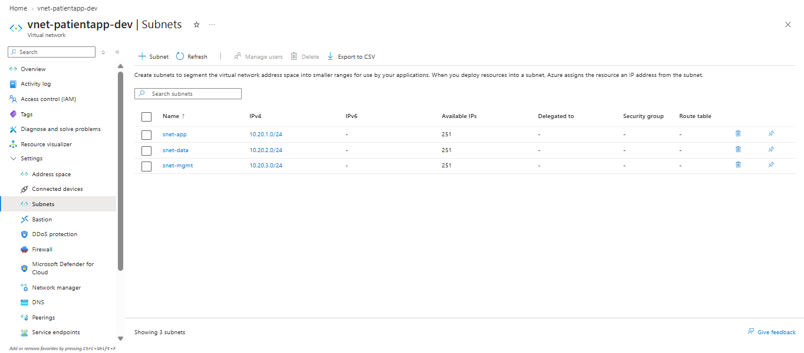
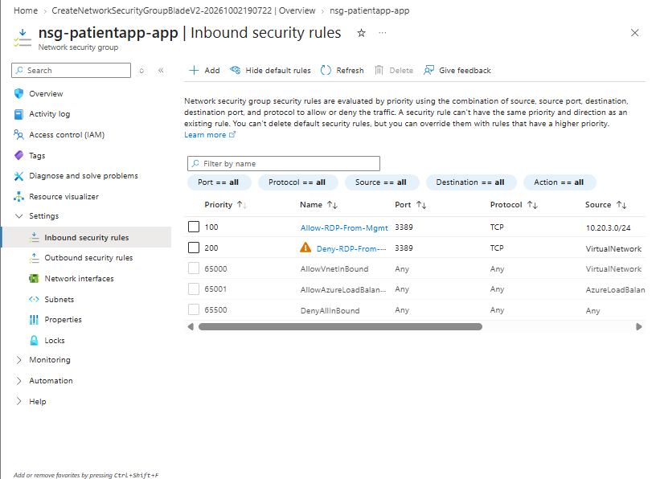
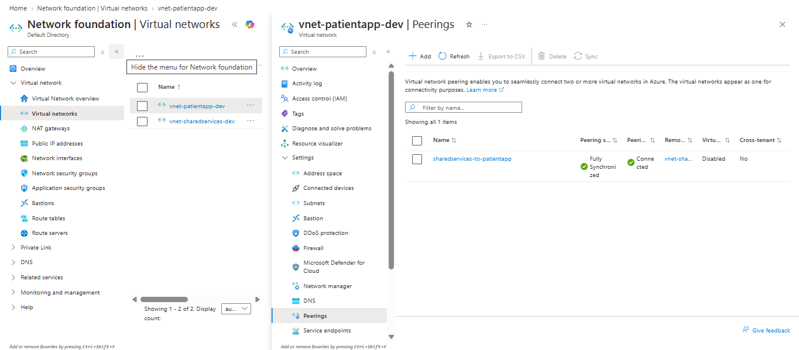
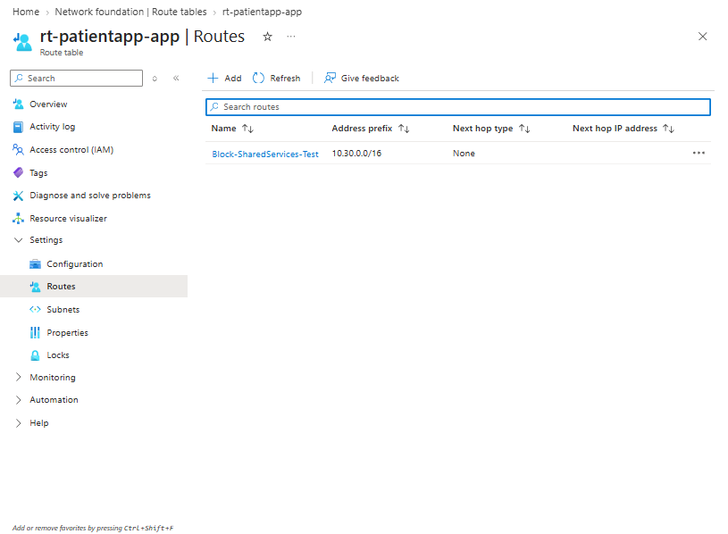
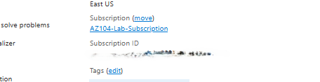
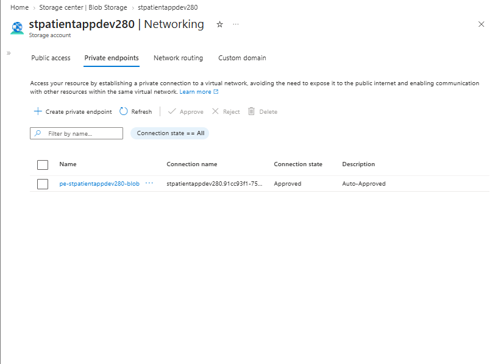
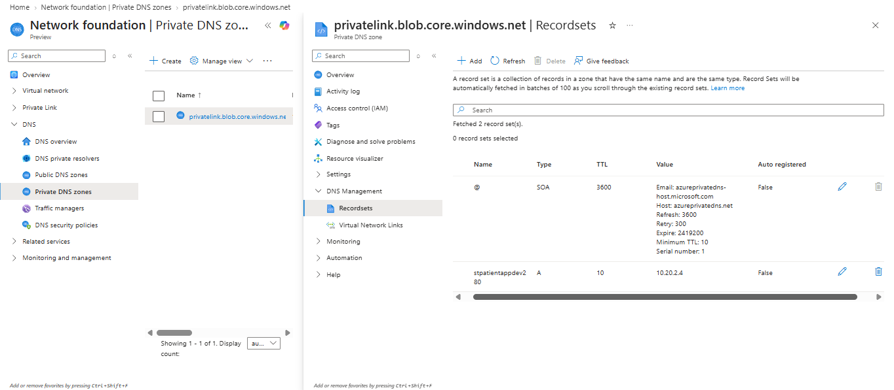
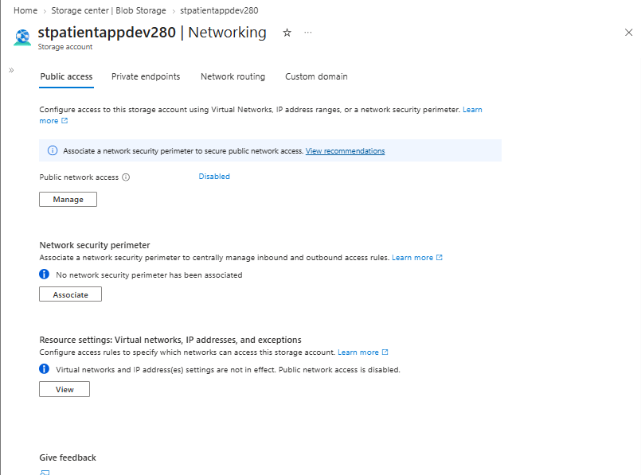

# Secure Azure Networking for a Healthcare Application Environment

## Overview

This project demonstrates the design and configuration of a segmented Azure network for a fictional healthcare organization, **Contoso Health Services**.

The environment separates application, data, and management workloads while implementing Network Security Groups, VNet peering, custom routing, Azure Private Link, private DNS, and Storage network isolation.

The project builds on previous Azure identity/governance and storage projects by securing access to an existing Azure Storage account through a private endpoint and disabling its public network endpoint.

## Business Scenario

Contoso Health Services is developing a patient-services application in Azure.

The application environment requires:

- Separate subnets for application, data, and management workloads
- Restricted administrative access
- Private connectivity between application and shared-services VNets
- Private access to Azure Blob Storage
- Private DNS resolution for the Storage endpoint
- Custom routing and route troubleshooting
- Storage isolation from the public internet

## Architecture

```text
Azure Subscription
│
├── rg-contoso-patientapp-dev
│   │
│   └── stpatientappdev280
│       ├── Public network access: Disabled
│       └── Blob Private Endpoint
│
└── rg-contoso-network-dev
    │
    ├── vnet-patientapp-dev
    │   │
    │   ├── snet-app
    │   │   └── 10.20.1.0/24
    │   │
    │   ├── snet-data
    │   │   ├── 10.20.2.0/24
    │   │   └── Storage Private Endpoint
    │   │
    │   └── snet-mgmt
    │       └── 10.20.3.0/24
    │
    ├── nsg-patientapp-app
    │   ├── Allow RDP from management subnet
    │   └── Deny RDP from other VNet sources
    │
    ├── rt-patientapp-app
    │
    ├── vnet-sharedservices-dev
    │   └── snet-shared
    │       └── 10.30.1.0/24
    │
    ├── VNet Peering
    │
    └── Private DNS
        └── privatelink.blob.core.windows.net
```

## Objectives

- Design a segmented Azure VNet
- Create application, data, and management subnets
- Configure Network Security Group rules
- Apply NSG rule-priority logic
- Configure VNet peering
- Create and troubleshoot a user-defined route
- Create an Azure Storage private endpoint
- Configure Private DNS integration
- Disable public Storage network access
- Practice Azure networking troubleshooting

## Implementation

### 1. VNet and Subnet Segmentation

Created:

`vnet-patientapp-dev`

Address space:

`10.20.0.0/16`

The VNet was divided into three `/24` subnets:

| Subnet | Address Range | Purpose |
|---|---|---|
| `snet-app` | `10.20.1.0/24` | Application workloads |
| `snet-data` | `10.20.2.0/24` | Private endpoints and data services |
| `snet-mgmt` | `10.20.3.0/24` | Management workloads |

This segmentation creates separate network boundaries for workloads with different security requirements.



## 2. Network Security Group

Created:

`nsg-patientapp-app`

The application network was configured with two custom inbound RDP rules:

| Priority | Rule | Source | Port | Action |
|---|---|---|---|---|
| 100 | Allow-RDP-From-Mgmt | `10.20.3.0/24` | TCP 3389 | Allow |
| 200 | Deny-RDP-From-VNet | VirtualNetwork | TCP 3389 | Deny |



NSG rules are evaluated in priority order, with lower numbers evaluated first.

The effective sequence is:

```text
100    Allow RDP from snet-mgmt
200    Deny RDP from VirtualNetwork
65000  AllowVNetInBound
65001  AllowAzureLoadBalancerInBound
65500  DenyAllInBound
```

This allows management hosts to use RDP while preventing other VNet sources from using RDP to application workloads.

## 3. VNet Peering

Created a second virtual network:

`vnet-sharedservices-dev`

Address space:

`10.30.0.0/16`

The application and shared-services VNets were connected using **VNet peering**.



The VNet address spaces do not overlap:

```text
vnet-patientapp-dev:      10.20.0.0/16
vnet-sharedservices-dev:  10.30.0.0/16
```

VNet peering provides private communication over the Azure backbone.

An important limitation is that VNet peering is **not transitive**.

## 4. User-Defined Routing

Created:

`rt-patientapp-app`

As a troubleshooting exercise, a temporary user-defined route was configured:

```text
Destination: 10.30.0.0/16
Next hop: None
```



The route intentionally created a routing blackhole.

Under normal conditions, Azure provides a system route through VNet peering:

```text
10.30.0.0/16 → Virtual network peering
```

The temporary UDR instead directed:

```text
10.30.0.0/16 → None
```

Traffic matching that route would be discarded.

### Remediation

The incorrect route was removed so Azure could again use the system route provided by VNet peering.



This exercise reinforced two important Azure routing concepts:

- User-defined routes can override system routes.
- Azure uses longest-prefix matching when multiple routes match a destination.

For example:

```text
10.30.0.0/16 → VNet peering
10.30.1.0/24 → Virtual appliance
```

Traffic to `10.30.1.25` uses the `/24` route because it is more specific.

## 5. Storage Private Endpoint

The existing Storage account:

`stpatientappdev280`

was connected to the application network using **Azure Private Link**.

The Blob private endpoint was created in:

`snet-data`

Target sub-resource:

`blob`

The private endpoint connection was successfully approved.



Unlike a service endpoint, a private endpoint gives the Azure service a **private IP address inside the VNet**.

This allows the Storage service to be accessed privately without relying on its public data endpoint.

## 6. Private DNS

Private DNS integration was configured using:

`privatelink.blob.core.windows.net`

An A record was created for the Storage account.

The record resolves the Blob endpoint to:

`10.20.2.4`



Conceptually:

```text
stpatientappdev280.blob.core.windows.net
                    ↓
              Private DNS
                    ↓
               10.20.2.4
                    ↓
          Private Endpoint
                    ↓
            Azure Blob Storage
```

The private endpoint provides the private IP address.

Private DNS ensures that applications resolve the normal Storage hostname to that private IP address.

## 7. Disable Public Storage Access

After Private Link and Private DNS were configured, public network access to the Storage account was disabled.



The intended access path becomes:

```text
Application workload
       ↓
Private DNS
       ↓
10.20.2.4
       ↓
Private Endpoint
       ↓
Azure Blob Storage
```

Instead of:

```text
Internet
   ↓
Public Storage Endpoint
```

This reduces the public exposure of the Storage data endpoint.

## Troubleshooting

### Intentional Routing Failure

A temporary route was created:

```text
10.30.0.0/16 → None
```

This caused traffic destined for the shared-services VNet to be discarded instead of using VNet peering.

The issue was corrected by removing the UDR and restoring the Azure system peering route.

This demonstrated the importance of checking:

- Route tables
- Destination prefixes
- Next-hop types
- System routes
- User-defined routes

during connectivity troubleshooting.

### VM Deployment Limitation

A test VM was planned to validate:

- DNS resolution
- Effective routes
- Private endpoint connectivity

The lab subscription did not expose an available VM SKU in East US despite available regional vCPU quota.

The Microsoft.Compute resource provider and quota availability were verified, but VM SKU availability remained restricted for the subscription.

Rather than redesigning the network around a subscription-specific limitation, configuration was validated using Azure control-plane resources.

## Validation Results

| Test | Expected Result | Result |
|---|---|---|
| Application VNet | `10.20.0.0/16` | Passed |
| Application subnet | `10.20.1.0/24` | Passed |
| Data subnet | `10.20.2.0/24` | Passed |
| Management subnet | `10.20.3.0/24` | Passed |
| Management RDP rule | Management subnet allowed | Passed |
| Broader VNet RDP rule | Other VNet RDP denied | Passed |
| VNet peering | Connected | Passed |
| Blackhole UDR | Traffic routed to None | Passed |
| UDR remediation | Incorrect route removed | Passed |
| Blob private endpoint | Connection approved | Passed |
| Private DNS | Blob hostname mapped to `10.20.2.4` | Passed |
| Storage public access | Disabled | Passed |
| Runtime VM test | SKU unavailable in lab subscription | Not completed |

## Security Decisions

### Network Segmentation

Application, data, and management workloads were separated into dedicated subnets.

### Restricted Management Traffic

RDP access was allowed from the management subnet while broader VNet RDP traffic was explicitly denied.

### Private Storage Connectivity

Azure Private Link was used to provide Blob Storage with private connectivity inside the VNet.

### Private DNS Resolution

Private DNS allows applications to use standard Azure Storage hostnames while resolving them to private endpoint addresses.

### Public Endpoint Isolation

Public network access to the Storage account was disabled after private connectivity was established.

## Key Azure Concepts Demonstrated

- Azure Virtual Networks
- CIDR addressing
- Subnets
- Network Security Groups
- NSG priorities
- Default NSG rules
- VNet peering
- Non-transitive peering
- Route tables
- User-defined routes
- Next-hop types
- Longest-prefix matching
- Azure system routes
- Azure Private Link
- Private endpoints
- Private DNS zones
- DNS A records
- Storage network isolation
- Public network access
- Network troubleshooting

## Lessons Learned

This project reinforced that successful Azure networking depends on several independent layers working together.

**NSGs** determine whether traffic is permitted.

**Route tables** determine where permitted traffic is sent.

**VNet peering** provides private network connectivity but does not provide transitive routing.

**Private endpoints** provide Azure services with private connectivity inside a VNet.

**Private DNS** ensures service hostnames resolve to the correct private endpoint IP.

The routing exercise demonstrated that even when VNet peering is correctly configured, a user-defined route can override the expected route and break connectivity.

A useful troubleshooting sequence is:

1. Check DNS resolution
2. Check NSG rules
3. Check effective routes and route tables
4. Verify VNet peering
5. Verify private endpoint status
6. Verify service-level network restrictions

## Cleanup and Cost Notes

Most resources in this lab have relatively low ongoing cost, although Azure Private Link can generate usage charges.

The test VM was not deployed because of subscription SKU restrictions, avoiding ongoing compute charges.

Resources can be removed after portfolio validation if they are no longer required.

The existing Storage account is reused across multiple AZ-104 portfolio projects.
