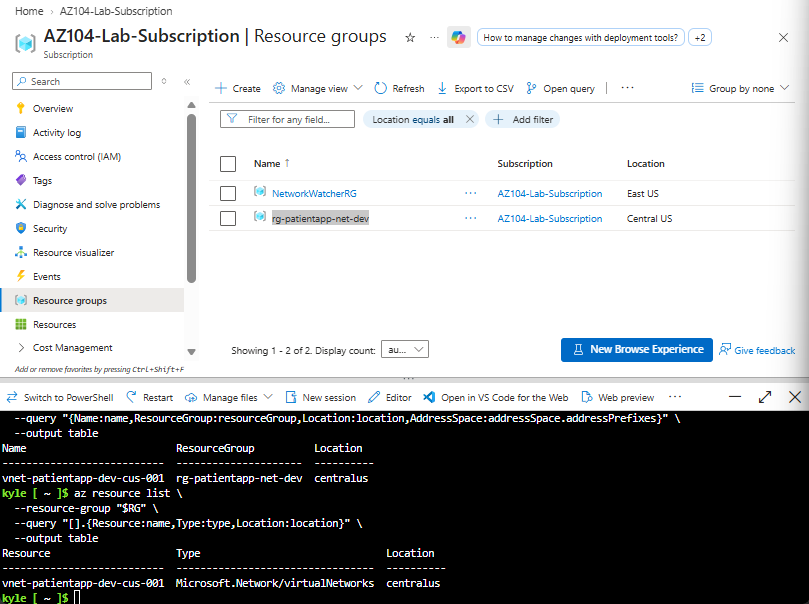
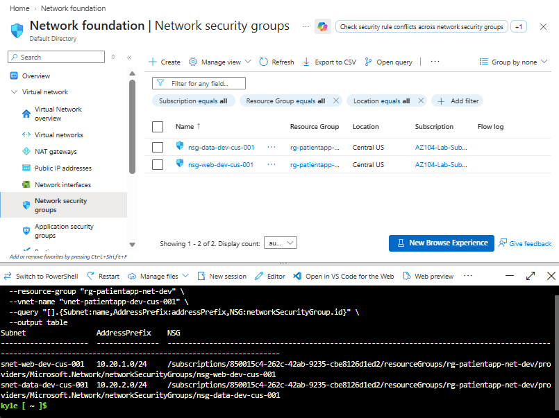
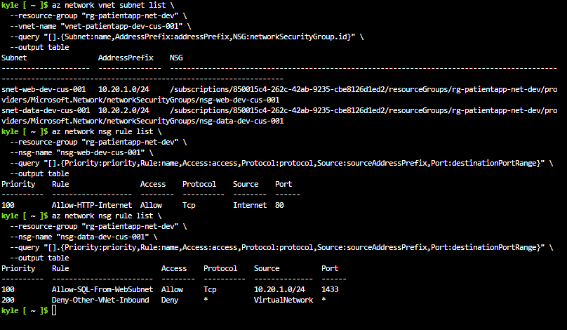
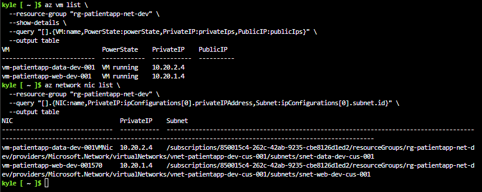
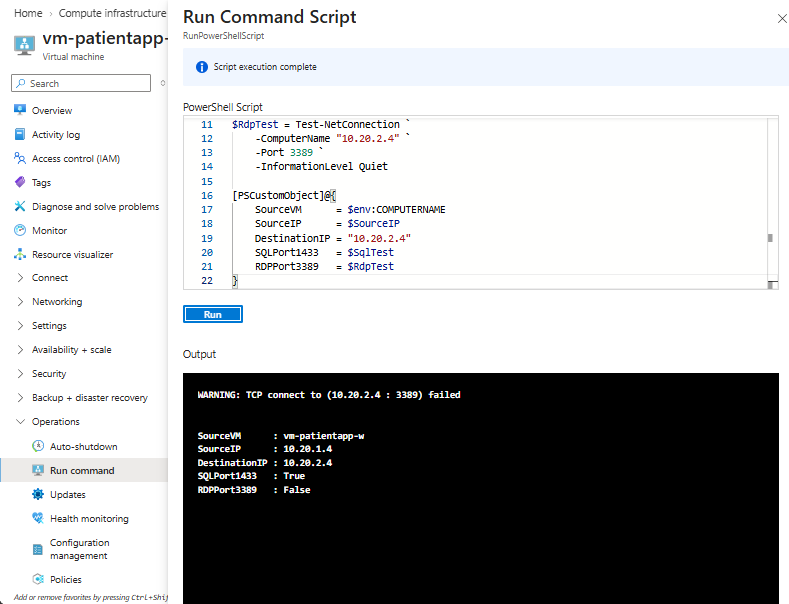
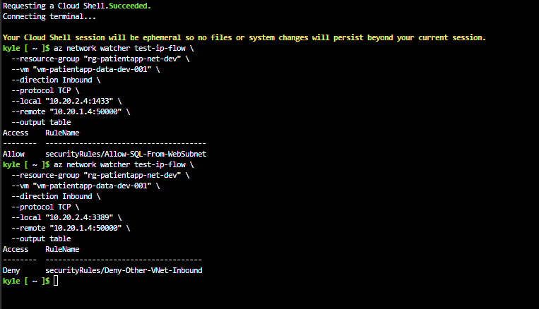

# Secure Azure Network Segmentation for a Patient Application

## Overview

In this AZ-104 lab, I built and tested a two-tier Azure network for a patient application. I placed the web and data workloads in separate subnets, used Network Security Groups (NSGs) to control traffic between them, and deployed two Windows Server VMs without public IP addresses.

The goal was simple: allow the web tier to reach the data tier on TCP port `1433`, but block other traffic such as RDP on port `3389`. I tested both paths, used Network Watcher to confirm which NSG rules made the decisions, and deleted the environment after the lab to avoid ongoing charges.

## Business Scenario

A healthcare application has a web tier and a data tier. The web server needs to communicate with the data server, but it should only have the access the application requires.

The network needed to:

- Place the web and data tiers in separate subnets
- Apply security rules at the subnet level
- Allow HTTP traffic from the internet to the web subnet
- Allow TCP `1433` from the web subnet to the data subnet
- Block other inbound VNet traffic to the data subnet
- Keep both VMs private with no public IP addresses
- Prove that the allowed connection worked and the unwanted connection was blocked
- Remove the lab resources after testing

## Architecture

```text
Azure subscription
└── rg-patientapp-net-dev (Central US)
    └── vnet-patientapp-dev-cus-001 — 10.20.0.0/16
        ├── snet-web-dev-cus-001 — 10.20.1.0/24
        │   ├── nsg-web-dev-cus-001
        │   └── vm-patientapp-web-dev-001 — 10.20.1.4
        └── snet-data-dev-cus-001 — 10.20.2.0/24
            ├── nsg-data-dev-cus-001
            └── vm-patientapp-data-dev-001 — 10.20.2.4
```

Both VMs used private IP addresses only. I attached the NSGs to the subnets instead of the individual network interfaces so that the same rules would apply to every resource placed in each tier.

## Resource Naming

I used a consistent naming pattern throughout the lab:

```text
<resource-type>-<workload>-<tier>-<environment>-<region>-<instance>
```

Examples:

- `rg-patientapp-net-dev`
- `vnet-patientapp-dev-cus-001`
- `snet-web-dev-cus-001`
- `nsg-data-dev-cus-001`
- `vm-patientapp-web-dev-001`

In these names, `dev` represents the development environment and `cus` represents Central US.

## Implementation

### 1. Resource Group and Virtual Network

I created the lab in Central US with the following network settings:

| Resource | Configuration |
|---|---|
| Resource group | `rg-patientapp-net-dev` |
| Region | `centralus` |
| Virtual network | `vnet-patientapp-dev-cus-001` |
| Address space | `10.20.0.0/16` |

The first check confirmed that the resource group and VNet were both created in the correct region.



### 2. Subnet Segmentation

I divided the VNet into two subnets so the web and data workloads could have different security rules.

| Subnet | Address range | Purpose |
|---|---|---|
| `snet-web-dev-cus-001` | `10.20.1.0/24` | Web-tier resources |
| `snet-data-dev-cus-001` | `10.20.2.0/24` | Data-tier resources |

Separating the tiers does not block traffic by itself, but it gives me separate boundaries where I can apply the correct NSG rules.

### 3. Network Security Groups

I created one NSG for each subnet and attached it at subnet scope.

| Subnet | Associated NSG |
|---|---|
| `snet-web-dev-cus-001` | `nsg-web-dev-cus-001` |
| `snet-data-dev-cus-001` | `nsg-data-dev-cus-001` |



The web NSG allowed HTTP traffic:

| Priority | Rule | Source | Destination port | Protocol | Action |
|---:|---|---|---:|---|---|
| 100 | `Allow-HTTP-Internet` | `Internet` | 80 | TCP | Allow |

The data NSG allowed the required SQL connection and denied other VNet traffic:

| Priority | Rule | Source | Destination port | Protocol | Action |
|---:|---|---|---:|---|---|
| 100 | `Allow-SQL-From-WebSubnet` | `10.20.1.0/24` | 1433 | TCP | Allow |
| 200 | `Deny-Other-VNet-Inbound` | `VirtualNetwork` | Any | Any | Deny |



NSGs process lower priority numbers first. That means traffic from the web subnet to port `1433` matches the priority `100` allow rule before it reaches the broader priority `200` deny rule. Other traffic from inside the VNet is denied.

### 4. Private Virtual Machines

I deployed two Microsoft Windows Server 2022 Datacenter: Azure Edition VMs. The selected size was `Standard_D2alds_v6` because it was available in the subscription and region during the lab.

| VM | OS computer name | Subnet | Private IP | Public IP |
|---|---|---|---|---|
| `vm-patientapp-web-dev-001` | Web-tier host | Web | `10.20.1.4` | None |
| `vm-patientapp-data-dev-001` | `pa-data-001` | Data | `10.20.2.4` | None |

I did not attach extra NSGs to the NICs because each subnet already had the correct NSG.



### 5. Test Service on the Data VM

To test an actual connection, I created a TCP listener on port `1433` on the data VM and added a matching Windows Defender Firewall rule. This gave the web VM a live service to connect to instead of testing the Azure configuration only on paper.

## Verified Results

I ran the connection tests from the web VM at `10.20.1.4` to the data VM at `10.20.2.4`.

| Validation | Expected | Verified result |
|---|---|---|
| Resource group and VNet location | Central US | Passed |
| Web subnet association | Web NSG attached | Passed |
| Data subnet association | Data NSG attached | Passed |
| TCP `1433` from web to data | Allowed | `True` |
| TCP `3389` from web to data | Blocked | `False` |
| IP Flow Verify for TCP `1433` | SQL allow rule | `Allow-SQL-From-WebSubnet` |
| IP Flow Verify for TCP `3389` | Data-tier deny rule | `Deny-Other-VNet-Inbound` |
| Resource group cleanup | Resource group removed | `false` |

The runtime test showed that the web VM could reach the data VM on port `1433`, while RDP on port `3389` was blocked.



I then used Network Watcher IP Flow Verify to identify the exact NSG rule behind each result. It confirmed that the SQL rule allowed port `1433` and the broader data-tier rule denied port `3389`.



## Evidence

The screenshots above document the main stages of the lab:

1. `01-vnet-region-verification.png` — resource group and VNet region
2. `02-subnet-nsg-associations.png` — subnet ranges and NSG associations
3. `03-custom-nsg-rules.png` — custom web-tier and data-tier rules
4. `04-vm-private-network-placement.png` — VM private IPs and subnet placement
5. `05-segmented-connectivity-test.png` — allowed TCP `1433` and blocked TCP `3389`
6. `06-ip-flow-verify-rule-results.png` — the NSG rule responsible for each result

## Troubleshooting

### Cloud Shell Timed Out

Cloud Shell timed out several times during the lab. When the session restarted, variables I had created earlier were gone, which caused later commands to fail or reference incomplete resource paths.

**Fix:** I reopened Cloud Shell and used self-contained commands with the full resource names. This made the commands easier to rerun after a timeout.

### Windows Computer Name Was Too Long

The first attempt to create the data VM failed because Azure tried to use the VM resource name as the Windows computer name. Windows computer names have a 15-character limit.

**Fix:** I kept the descriptive Azure resource name `vm-patientapp-data-dev-001`, but used `pa-data-001` as the shorter Windows computer name.

### Preferred VM Size Was Unavailable

The smaller VM size I originally planned to use was not available for this subscription and region.

**Fix:** I selected an available two-vCPU size for the temporary lab and deleted the resource group after testing so the VM would not continue generating charges.

### Connection Test Ran From the Wrong VM

I first ran the connection test from the data VM to itself. Both ports returned `True`, but that result did not test traffic crossing from the web subnet to the data subnet.

**Fix:** I checked the source hostname and IP address, then reran the test from the web VM at `10.20.1.4`. The correct results were TCP `1433 = True` and TCP `3389 = False`.

### Third-Party Marketplace Image Appeared First

The first Windows Server result in the Azure Marketplace was published by a third party instead of Microsoft.

**Fix:** I checked the publisher and selected the Microsoft Windows Server 2022 image.

## Security Decisions

- **Separate subnets:** The web and data tiers were placed in different subnets so each tier could have its own security policy.
- **Limited data-tier access:** Only TCP `1433` was allowed from the web subnet to the data subnet.
- **Explicit deny rule:** Other inbound traffic from the VNet to the data subnet was blocked.
- **No public IP addresses:** Neither VM was directly reachable from the internet.
- **Subnet-level NSGs:** Security rules applied consistently to resources placed in each subnet.
- **Two types of validation:** `Test-NetConnection` proved the real connection behavior, and IP Flow Verify showed which NSG rule caused it.

## What I Learned

- NSG rules are evaluated by priority, with lower numbers processed first.
- A specific allow rule can be placed ahead of a broader deny rule to permit only the required traffic.
- A connection test is only useful if it runs from the correct source and targets the correct destination.
- `Test-NetConnection` shows whether a port is reachable, while IP Flow Verify explains which NSG rule allows or denies the traffic.
- Azure VM resource names and Windows computer names follow different naming limits.
- Cloud Shell sessions and variables can disappear after a timeout, so repeatable commands should not depend on old session variables.
- Separate private subnets do not automatically create security. The traffic still needs to be controlled and tested.

## Cost and Cleanup

I kept the VMs running only long enough to finish the connection tests and capture the evidence. After the lab, I deleted the entire resource group:

```bash
az group delete \
  --name "rg-patientapp-net-dev" \
  --yes \
  --no-wait
```

I verified the deletion with:

```bash
az group exists --name "rg-patientapp-net-dev"
```

Verified output:

```text
false
```

This removed the VNet, subnets, NSGs, NICs, disks, and VMs created for the lab.

## AZ-104 Skills Demonstrated

- Created and configured an Azure VNet and subnets
- Planned private IPv4 address ranges using CIDR notation
- Created and associated subnet-level NSGs
- Configured rule priorities for allowed and denied traffic
- Deployed private Windows Server VMs into specific subnets
- Used Azure VM Run Command to configure and test the VMs
- Tested port connectivity with PowerShell
- Used Network Watcher IP Flow Verify to troubleshoot NSG behavior
- Verified Azure resources with Azure CLI
- Deleted and confirmed the cleanup of temporary Azure resources
